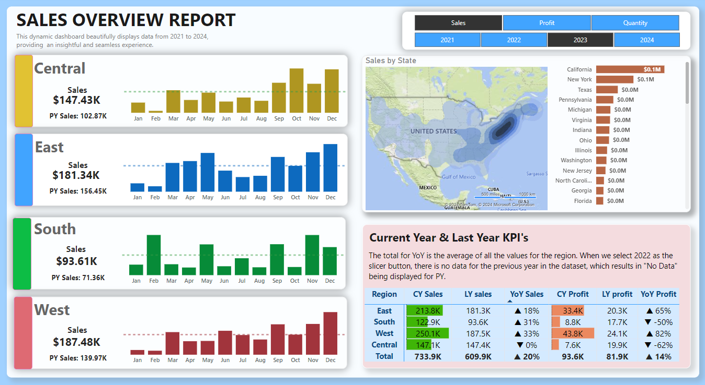

# Sales Overview Report

## Overview
This project showcases a dynamic **Sales Overview Dashboard** built using Power BI. The dashboard is designed to provide insightful analysis of key performance indicators (KPIs) such as **Sales**, **Profit**, and **Quantity** across four regions: Central, East, South, and West. 

The purpose of this report is to enable stakeholders to:
- Filter data by year.
- Dynamically switch between KPIs (Sales, Profit, Quantity).
- Compare current year (CY) metrics with previous year (PY) metrics.
- Analyze monthly trends for better decision-making.

---

## Dashboard Overview


---

## DAX Calculations
Here are some of the DAX calculations used in this project along with their explanations:

1. **Total Sales (Current Year):**
   ```DAX
   TotalSalesCY = SUM(Sales[SalesAmount])
   ```
   Calculates the total sales amount for the selected year.

2. **Total Sales (Previous Year):**
   ```DAX
   TotalSalesPY = CALCULATE(SUM(Sales[SalesAmount]), SAMEPERIODLASTYEAR(Sales[Date]))
   ```
   Retrieves sales data for the same period in the previous year to allow year-over-year comparisons.

3. **YoY Sales Growth:**
   ```DAX
   YoYSalesGrowth = DIVIDE([TotalSalesCY] - [TotalSalesPY], [TotalSalesPY], 0)
   ```
   Calculates the year-over-year growth percentage for sales.

4. **Monthly Average Line:**
   ```DAX
   MonthlyAverage = AVERAGE(Sales[SalesAmount])
   ```
   Computes the average sales per month to identify trends over time.

5. **YoY Profit:**
   ```DAX
   YoY Profit = 
   VAR Positive = UNICHAR(9650)
   VAR Negative = UNICHAR(9660)
   VAR YoY = DIVIDE([CY Profit] - [LY profit], [LY profit]) 
   VAR YoYFormat = FORMAT(YoY, "0%")
   VAR YoY_icon = IF(YoY > 0, 
                     Positive & " " & YoYFormat,
                     Negative & " " & YoYFormat)
   RETURN YoY_icon
   ```
   Displays year-over-year profit growth with dynamic icons indicating positive or negative change.

6. **CY Profit:**
   ```DAX
   CY Profit = TOTALYTD([Total Profit], 'Calendar'[Date]) 
   ```
   Calculates the cumulative profit for the current year up to the selected date.

7. **LY KPI Sales:**
   ```DAX
   LY KPI Sales = 
   VAR TheYear = SELECTEDVALUE('Calendar'[Year])
   VAR LYSales = CALCULATE([Total Sales], 'Calendar'[Year] = (TheYear - 1))
   VAR FormatLYSales = FORMAT(LYSales / 1000, "0.00K")
   VAR Logic = IF(FormatLYSales = "", "PY Sales : --", "PY Sales: " & FormatLYSales)
   RETURN Logic
   ```
   Formats and displays previous year's sales in a user-friendly manner.

8. **LY Profit:**
   ```DAX
   LY profit = CALCULATE([Total Profit], 'Calendar'[Year] = MAX('Calendar'[Year]) - 1) 
   ```
   Retrieves profit data for the previous year.

---

## Steps to Create the Dashboard

1. **Data Preparation:**
   - Imported the dataset into Power BI.
   - Performed data cleaning and transformation to ensure accuracy.

2. **Data Modeling:**
   - Established relationships between tables.
   - Created calculated columns and measures using DAX.

3. **Dashboard Design:**
   - Designed an intuitive layout with regional sections for Central, East, South, and West.
   - Added slicers for year and KPIs to enhance interactivity.

4. **Visualization:**
   - Used bar charts, line charts, and sparklines to represent trends and comparisons.
   - Included a map visualization for sales by state.

---

## Contact
For further inquiries or feedback, feel free to reach out:

- **Name:** Bahaa Medhat Wanas  
- **Email:** bahaawanas427@gmail.com  
- **LinkedIn:** [Bahaa Wanas](https://www.linkedin.com/in/bahaa-wanas-9797b923a)
---
